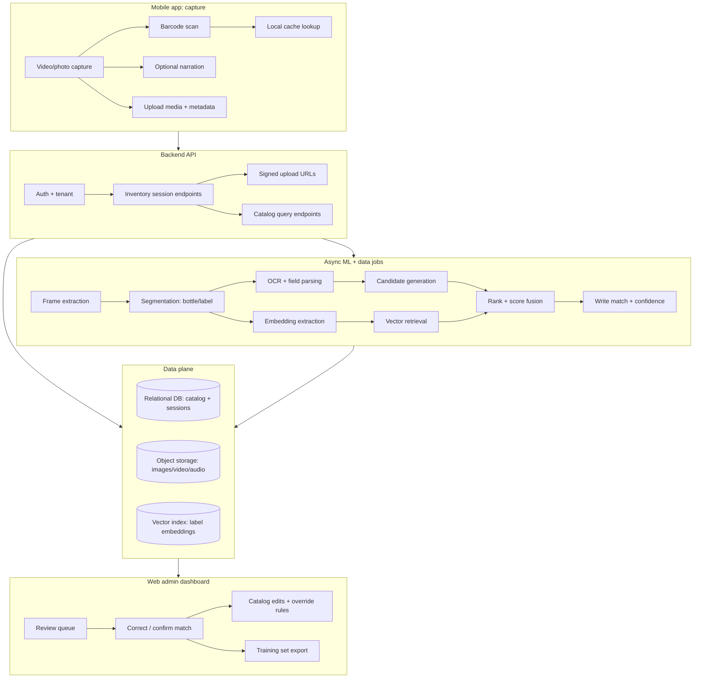

# Deep Research Report on bartools for an AI-Assisted Bar Inventory System

## Executive summary

The key design signal in the repository is the note **“Where to get SKUs – UPC/GTIN-12 this is the important one”**. citeturn4view0 That single line implies a *hard architectural constraint*: your system’s bottle catalog and ML labels should be anchored to **standardized product identifiers** (GTINs—especially GTIN‑12/UPC‑A), because everything else (brand names, fuzzy OCR text, images) is ambiguous at scale. GS1 explicitly frames **UPC‑A as encoding a GTIN‑12** and explains why “UPC” and “GTIN‑12” are often used interchangeably in practice. citeturn26search0turn26search11turn26search19

In the current repo, the codebase is an early scaffold: a **Bun workspace monorepo** with a minimal **Hono** backend, a starter **Vite/React** dashboard, an **Expo** mobile starter, and a tiny shared UI package. citeturn24view0turn6view0turn10view0turn16view0turn20view0turn33search1turn33search4turn33search6 There is no database layer, auth, media ingestion, ML pipeline, or catalog strategy implemented yet—so the repo is best interpreted as a “vertical slice starter kit,” not an inventory system.

On the data side, there is **no comprehensive open global GTIN/UPC database**; you will almost certainly need a hybrid of (a) official / authoritative registries and (b) commercial lookups and/or partnerships. citeturn34search19turn26search2turn26search5 For alcohol specifically, the most “official” image corpus in the U.S. is the **Public COLA Registry** (label approvals) from the federal regulator, which includes **approved label application images** for many years. citeturn29view0turn27search6 However, it is *not a UPC catalog*; it is a regulatory label database. You’ll likely combine it with UPC/price/product-list datasets (for example, U.S. state control datasets like **Iowa Liquor Products** with UPC and pricing fields) and/or commercial barcode APIs for broad coverage. citeturn46view0turn56search3turn39search0

The recommended integration architecture therefore centers on **multi-signal matching** with a strict priority order:
1) barcode/GTIN when available, 2) OCR-derived structured fields (brand, expression, size, ABV), 3) image-embedding similarity of label crops, and 4) human-in-the-loop review in the admin dashboard—feeding corrections back into the catalog and training set.

## Repository deep-dive with emphasis on the “important one” line

### Extracted “this is the important one” sentence and immediate context

In `docs/init_research_notes.md`, the repo contains the explicit line:

> “Where to get SKUs - UPC/GTIN-12 this is the important one” citeturn4view0

Nearby notes capture the intended inventory workflow and model targets (bottle information, detecting bottles in photos, and leveraging segmentation/object detection). citeturn4view0

### What that line implies for architecture

A GTIN-first approach means your system should treat **GTIN (normalized across GTIN‑8/12/13/14)** as the canonical product key whenever possible:

- **Canonical ID strategy (catalog backbone).** A UPC‑A on U.S. retail products encodes a **GTIN‑12**, and GS1 documentation reinforces that relationship. citeturn26search0turn26search11turn26search19 Architectural action: store identifiers as strings (preserve leading zeros), validate check digits, and normalize to a consistent internal format (commonly GTIN‑14 with left‑padding) while keeping the “as scanned” raw value for forensics.
- **Data acquisition strategy.** If GTIN is the key, your ingestion pipeline must include at least one high-coverage GTIN→(brand, name, size, images) lookup path. GS1’s ecosystem provides “brand-authorised product data” via Verified by GS1, but it is a service, not an open dump. citeturn26search2turn26search13turn26search5
- **Mobile capture UX.** To make GTIN your backbone, the mobile app must make barcode capture **fast, reliable, and optional** (fallbacks needed). On-device barcode scanning APIs (e.g., ML Kit) emphasize offline scanning and standard format support. citeturn64search3turn64search7

### What that line implies for data quality and schema

GTIN-centric design shifts complexity into **product variants and packaging**:

- Multiple GTINs exist for the “same” brand family (different sizes, multi-packs, gift sets). Any schema needs a parent/child or “equivalence” model (e.g., `product_identity` vs `package_variant`) and must represent `volume_ml`, `pack_count`, and “bar pour unit” conversions.
- You will still need **non-GTIN fallbacks**. Many bar bottles are:
  - poured from large “handle” formats where barcodes are scuffed,
  - stored with speed pourers covering labels,
  - or are distributor-only / limited releases where a barcode may be absent or non-standard.
  This makes **OCR** + **image matching** necessary for coverage.

### What that line implies for ML strategy

With GTIN as the label key, ML becomes more tractable:

- **Training data becomes self-labelable** whenever the barcode is captured alongside imagery. That yields high-quality supervised examples (image/audio → GTIN).
- Your model objective is less “recognize *text string*” and more “retrieve the correct GTIN record.” This favors **retrieval + ranking** over pure classification for the long tail.
- Segmentation is still central for robustness. The Segment Anything line of work is explicitly designed for promptable segmentation and transfer to new domains, and SAM 2 extends promptable segmentation to images and videos. citeturn63search0turn63search1turn63search9 For bar inventory, segmentation is most valuable for producing consistent crops of:
  - bottle silhouette,
  - front label rectangle,
  - neck label,
  - cap top,
  which then feed OCR and embedding extraction.

## Repo audit: key components, tech stack, gaps, and integration points

### High-level structure and stack

The repository at entity["company","GitHub","code hosting platform"] hosts a Bun workspaces monorepo (`workspaces: ["packages/*"]`) with dev scripts for backend, dashboard, and mobile. citeturn24view0turn33search1

The backend package is a minimal TypeScript service using Hono, running on Bun. citeturn6view0turn7view0turn33search4turn33search0 The dashboard is a Vite+React app that also includes `react-native-web` and a Vite plugin to support it, suggesting an intent to share UI primitives across web and mobile. citeturn10view0turn11view0turn33search3turn33search19 The mobile app is an Expo starter (SDK 54 / React Native 0.81 era). citeturn16view0turn17view0turn33search6turn33search2 A small shared UI workspace exports a `Button` and a `greet` helper. citeturn20view0turn23view1turn22view0turn23view0

### Key files and what they currently do

- Root `package.json`: declares workspaces and dev commands; no CI, lint orchestration, or environment management shown. citeturn24view0
- `packages/backend/src/index.ts`: a minimal API server skeleton; no routes for inventory, uploads, or auth. citeturn9view0
- `packages/dashboard`: Vite/React app scaffold, depends on shared UI and RN-web compatibility. citeturn10view0turn11view0turn33search3
- `packages/mobile/App.tsx`: simple counter UI using shared `Button`; no camera, no microphone, no upload, no offline cache. citeturn17view0
- `packages/ui`: exports `Button` and `greet`; peer dependency expectations appear ahead of the mobile version pins (potential compatibility friction). citeturn20view0turn16view0
- `docs/init_research_notes.md`: contains the GTIN/UPC imperative plus early ML notes. citeturn4view0
- `docs/bar_notes.md`: early customer discovery notes referencing distributors/ordering and time spent counting bottles (problem framing). citeturn25view0

### Component-to-feature fit table

| Required system capability (your target) | Current repo component(s) | Coverage today | Integration points and missing pieces |
|---|---|---|---|
| Bottle catalog service (canonical identities, variants, GTIN normalization) | None implemented; only notes in `docs/init_research_notes.md` | Not implemented | Requires DB schema + ingestion jobs + GTIN validation rules. GTIN‑12/UPC emphasis is explicit. citeturn4view0turn26search0turn26search11 |
| Auth + multi-tenant bars/venues + roles | None | Not implemented | Needs authentication, role-based access control, tenant isolation, audit logging. |
| Inventory sessions (start/stop, per-shelf, per-bar area, time-stamped) | None | Not implemented | Needs session model and APIs; likely driven by mobile capture workflows. |
| Media ingestion (video/photo upload, storage, dedupe) | Backend skeleton only | Not implemented | Needs signed uploads, object storage, content hashing, lifecycle management. Backend is a minimal Hono server. citeturn6view0turn9view0turn33search4 |
| Mobile capture (camera, barcode scan, narration recording) | Expo starter app | Minimal scaffold | Needs camera, barcode scanner, microphone + upload queue. Expo SDK provides device packages, but none are wired. citeturn17view0turn33search2turn64search3 |
| Admin workflow (review matches, corrections, catalog editing) | Dashboard scaffold | Minimal scaffold | Needs UX for candidate matches, correction UI, training-data export, user management. citeturn10view0 |
| ML pipeline (frame extraction, segmentation, OCR, embeddings, matching) | Notes only | Not implemented | Requires batch/stream workers + model hosting. Notes mention segmentation/detection; SAM/SAM2 are relevant candidates. citeturn4view0turn63search0turn63search1 |
| Pricing + reorder support | None | Not implemented | Requires product pricing sources (state control price files, Open Prices, retailer/partner feeds) and reorder logic. citeturn32search0turn46view0turn56search3 |

## Bottle catalog data sources: databases, datasets, and APIs relevant to bar bottles

A critical reality: **GTIN is the correct “join key,” but global GTIN→product attribute data is not broadly open**. citeturn34search19turn26search2 This section lists the most relevant sources for “what bottles exist” aligned to your requirements (brand, bottle name, volume, ABV, category, images, UPC/EAN, manufacturer, country, price).

image_group{"layout":"carousel","aspect_ratio":"16:9","query":["barcode scan on bottle label","liquor bottle label close-up","bar shelf spirits bottles"],"num_per_query":1}

### Official and quasi-official regulatory / control-state sources

**Public COLA Registry (U.S. label approvals).** The federal alcohol regulator, entity["organization","Alcohol and Tobacco Tax and Trade Bureau","us alcohol regulator"], provides a Public COLA Registry with access to COLA records and states that **electronically approved and paper images are available** for COLAs issued from 1999 to present (with some historical caveats). citeturn29view0turn27search6  
- Data fields: approval identifiers, product/permittee details, and label application imagery (screenshots/scans); exact field set varies by record. citeturn29view0turn27search6turn27search9  
- Images: label application images (“printable versions”), useful as training data for label text/layout. citeturn27search6turn27search9  
- Access: public search UI; also cataloged as a “Search and Download” dataset endpoint via Data.gov. citeturn28view0turn29view0  
- Update frequency: the Data.gov metadata describes update frequency as irregular, reflecting operational publishing. citeturn28view0  
- Cost: free public access for search. citeturn29view0  
- Suitability: strong for **label images + regulatory attributes**, weaker for UPC/retail packaging mapping.

**State control datasets (example: Iowa Liquor Products + price books).** The “Iowa Liquor Products” dataset is published as a public dataset with a **CC BY 4.0** license and provides downloadable resources (CSV/JSON/XML) via the Iowa open data portal catalog listing. citeturn46view0  
- Fields: the dataset’s downloadable CSV is explicitly shown to include **UPC, SCC, proof, bottle volume, vendor, state bottle/case costs, and retail** in addition to description/category. citeturn56search3turn56search9  
- Pricing: Iowa price book PDFs include UPC alongside proof/size/price columns, reflecting a structured catalog useful for “typical price” baselines. citeturn39search0  
- Suitability: excellent for GTIN/UPC anchoring and pricing in a control-state context; no images.

**State registration datasets (example: Connecticut Liquor Brands).** The “Liquor Brands” dataset from Connecticut describes required brand/manufacturer registration and provides downloadable resources, but no explicit license is provided in the Data.gov catalog entry. citeturn60view0  
- Suitability: useful as a cross-check for brand/manufacturer identity; generally not a bottle-image catalog.

**Industry control-state aggregations (subscription).** entity["organization","National Alcohol Beverage Control Association","us alcohol control states org"] offers “Statistics for Alcohol Management (SAM)” as a control-state dataset product. The SAM document explicitly states subscription access paths and provides **pricing ($1,800 per month per state, up to a maximum of 10 states / $18,000)**. citeturn65search3turn65search11  
- Suitability: strong for production-grade sales/pricing analytics within control-state jurisdictions; likely contractual constraints for ML training images (since images aren’t the focus).

### Open, community-driven product catalogs with images

**Open Food Facts (OFF).** entity["organization","Open Food Facts","open food database project"] provides an open product database accessible by API and data dumps, with data released under ODbL. citeturn30search6turn30search0turn32search5 OFF’s product API exposes product images fields (including URLs for different sizes such as `image_thumb_url`, `image_small_url`, `image_url`) and “images” payloads. citeturn67search1turn30search1turn67search15  
- Scale: OFF describes itself as a multi‑million product database (commonly cited “over 3 million products”). citeturn30search2turn32search5  
- Images: OFF announced an open dataset of **over 6.7 million food packaging images**, with extracted OCR text, made accessible via an AWS Open Dataset effort. citeturn67search17  
- Image constraints: OFF’s upload tutorial specifies **a minimal allowed photo size of 640×160 px**, indicating a floor for image quality in the contributor pipeline. citeturn67search6  
- Licensing: OFF data is ODbL; product images are Creative Commons Attribution ShareAlike, and guidance notes images may contain graphical elements subject to other rights. citeturn30search6turn30search16turn67search7  
- Suitability: strong for “barcode → product + images” bootstrapping (including some alcohol), but coverage for bar spirits varies and ODbL “share-alike” constraints affect how you can merge with proprietary data. citeturn30search23

**Open Prices (optional price enrichment).** OFF also maintains an “Open Prices” project, described as storing prices of products and making them available via a REST API and web interface. citeturn32search0turn32search2turn32search1 Suitability depends on the availability/coverage of alcohol prices in contributing regions.

### Commercial barcode/Gtin APIs (broad coverage, contractual limits)

These are useful operationally for “unknown barcode → product name/images,” but they are rarely suitable as *training data* without explicit rights.

**Barcode Lookup API.** entity["company","Barcode Lookup","barcode product database"] markets an API that returns product name, category, description, images, and retail pricing. citeturn61search0turn65search8 Documentation states that monthly call limits depend on plan subscription and provides rate limit guidance. citeturn65search0 Terms exist separately and should be treated as binding constraints. citeturn61search6

**UPCitemdb API.** entity["company","UPCitemdb","upc lookup service"] provides lookup and search endpoints. citeturn61search2 It publishes explicit plan pricing (e.g., DEV $99/month, PRO $699/month) and call limits/overage rates. citeturn65search1turn65search5 A dedicated terms page governs API use. citeturn61search1

**Go-UPC.** entity["company","Go-UPC","barcode database api provider"] claims access to product info and photos and states coverage “over 1‑billion unique items,” with pricing tiers (Developer ~$74.95/month, Startup, Enterprise $795/month) shown in plan flows. citeturn65search6turn65search2turn65search20

**EAN‑DB (barcode database with published stats).** entity["company","EAN-DB","barcode lookup provider"] publishes database statistics like total products and metadata coverage, and offers paid API calls and bulk options. citeturn61search15

### Beverage-alcohol-specific commercial catalogs

**U.P.C. Data 4 Beverage Alcohol.** entity["company","U.P.C. Data 4 Beverage Alcohol","beverage alcohol upc database"] positions itself as an alcohol-specific UPC/EAN indexed database, claiming more than **150,000 records**, built from data and package labels supplied by producers, and “continuously maintained.” citeturn59search0  
- Suitability: promising for alcohol specificity; requires direct commercial diligence on rights, completeness, and how images are sourced.

**COLA Cloud (TTB registry operationalization).** entity["company","COLA Cloud","ttb cola registry api"] is a commercial layer on top of TTB COLA data, claiming API access and enrichment over millions of label approvals. citeturn27search5  
- Suitability: useful if you need production API ergonomics over COLA imagery and metadata, but requires a contract and licensing review.

## Image recognition datasets and OCR/label-reading tools

### Product/bottle recognition datasets relevant to “behind a bar” environments

**Open Images (broad object coverage).** Open Images is described as a dataset of ~9M images annotated with labels, bounding boxes, segmentation masks, and relationships. citeturn62search0 The Open Images paper emphasizes that images have a Creative Commons Attribution license and were collected from Flickr, enabling broad reuse under attribution terms. citeturn62search12  
- Suitability: good for generic “bottle / wine bottle” detection pretraining; weak for SKU-level alcohol identification.

**RPC (Retail Product Checkout dataset).** The RPC dataset is presented as a large-scale retail checkout dataset with single-product and multi-product images and fine-grained categories. citeturn62search2turn62search10 The project page states a **CC BY‑NC‑SA 4.0** license and indicates a Kaggle distribution size (15 GB). citeturn62search10  
- Suitability: strong for “dense retail product recognition” methods and evaluation; the NonCommercial clause limits production reuse.

**Products‑10K.** Products‑10K is a human-labeled SKU-level product recognition dataset with 10,000 products frequently bought on a major e-commerce platform; the arXiv abstract emphasizes SKU-level fine-grained recognition and dataset availability. citeturn62search7turn62search3  
- Suitability: good for SKU-level recognition method development; domain shift from bar shelves is non-trivial.

**SKU‑110K (dense shelves).** The SKU‑110K project discusses detection in densely packed retail shelf scenes. citeturn62search5  
- Suitability: useful for “many adjacent items” detection training, similar to a crowded backbar, but labels are not “which SKU,” rather object instances.

**OFF-derived detection datasets (logos, nutrition tables).** OFF publishes task datasets such as nutrition table detection (licensed CC‑BY‑SA 3.0 “like the original images”). citeturn67search7turn67search17  
- Suitability: OFF image ecosystem is relevant because bar bottles are heavily logo/label driven; logo detection transfers well to spirits labels.

### OCR and barcode toolchain components

For your specific UX (“filming/photographing/narrating”), barcode and OCR are often the highest-ROI signals.

**Barcode scanning.**  
- ZXing is an open-source multi-format 1D/2D barcode processing library and lists support for UPC‑A/UPC‑E/EAN formats. citeturn64search2  
- Google’s ML Kit barcode scanning documentation states it reads most standard barcode formats and runs on-device without requiring network connectivity. citeturn64search3turn64search7

**OCR.**  
- Tesseract describes itself as an open source OCR engine available under Apache 2.0. citeturn64search12turn64search4  
- PaddleOCR is a widely used open-source OCR toolkit, positioned for extracting structured data from images/PDFs. citeturn64search1

## Recommended integration approach: schema, matching strategy, and ML pipeline

### Canonical schema design for a bottle catalog

A GTIN‑anchored schema should separate **identity**, **packaging**, and **evidence**:

- `product_identity` (logical product): normalized brand/producer family-level concepts (e.g., “Brand X Bourbon”).
- `package_variant` (sellable unit): GTINs (GTIN‑12/13/14), volume_ml, pack_count, container type, ABV, country, etc.
- `catalog_media`: canonical images (front product shot, label crop, back label, cap) with provenance + license metadata.
- `regulatory_label_reference`: references to COLA IDs and label application images when applicable. citeturn29view0turn27search6
- `price_observation`: price, date, source, geography (control-state price lists, OFF Open Prices, etc.). citeturn39search0turn32search0
- `inventory_session` / `inventory_observation`: what a particular venue saw at time T, with media assets and computed matches.

**Why this separation matters:** OFF and many other catalog sources provide *heterogeneous and sometimes conflicting* data and images. OFF’s ODbL share-alike implications become much easier to handle if you keep “OFF-derived database” as a clearly partitioned layer or as a “source table” rather than mixing indistinguishably with proprietary enrichments. citeturn30search23turn30search6

### Matching strategy: deterministic first, then probabilistic

A production-grade matching approach for bar inventory should be **tiered**:

**Barcode-to-catalog (highest precision).**  
1) Scan UPC/EAN and validate structure and check digit rules where possible (GTIN conventions are well-documented in GS1 materials). citeturn26search7turn26search11  
2) Normalize to internal representation and query:
   - brand-authorized lookup (e.g., Verified by GS1 or GS1 member APIs) where contractually possible, citeturn26search2turn26search5  
   - open lookups like OFF (with ODbL compliance), citeturn32search5turn30search6  
   - commercial APIs (Barcode Lookup / UPCitemdb / Go‑UPC) where permitted by terms and for operational convenience. citeturn65search0turn61search1turn65search2  

**OCR-assisted candidate generation (high recall).**  
OCR works best when you can robustly crop the label area; OFF explicitly ties photo quality to OCR usefulness. citeturn67search6turn30search1  
- Use segmentation to isolate label regions before OCR; SAM establishes a promptable segmentation approach and SAM 2 extends to video, which is especially useful for your “filming” workflow (propagate masks across frames). citeturn63search0turn63search1  
- Parse OCR into structured fields: brand tokens, expression (e.g., “reposado”), volume, ABV. Control-state datasets (like Iowa) show “proof,” “bottle volume,” and UPC patterns you can use to validate extracted structure. citeturn56search3turn56search9turn39search0  

**Image embedding retrieval (best for messy labels).**  
For long-tail bottles where OCR is imperfect (reflective glass, stylized fonts), use learned image embeddings and nearest-neighbor retrieval.
- CLIP provides a widely cited paradigm for transferable vision-language representations useful for retrieval and ranking. citeturn63search2turn63search10  
- Store label embeddings in a vector index keyed to `package_variant` (GTIN when available) or to `product_identity` where GTIN is unknown.

**Human-in-the-loop review (essential for correctness).**  
Even with GTIN emphasis, your domain (bars) includes edge cases: house-infused bottles, relabeled containers, novelty packaging. Admin review is the mechanism that converts uncertain predictions into training data.

### Suggested ML pipeline and operational architecture

Below is a reference architecture consistent with the repo’s current separation (backend + dashboard + mobile), but adding the missing ML and data planes.

This architecture is consistent with the repo’s current intent (“backend API + admin dashboard + mobile capture”), but highlights what must be added: persistent storage, a job pipeline, and review tooling. citeturn24view0turn6view0turn10view0turn16view0turn4view0

## Legal/licensing risks and data quality issues

### Licensing constraints that directly affect your catalog plan

- **ODbL share-alike (OFF).** OFF’s community guidance explicitly notes that combining OFF data with other databases can trigger ODbL obligations such that the resulting database must be released as open data, and therefore must only be combined with sources permitting such redistribution. citeturn30search23turn30search6 This is a major architectural decision: you may need a “clean-room separation” between OFF-derived datasets and proprietary/commercial enrichments.
- **Image licenses and embedded rights.** OFF-related guidance highlights that product images are Creative Commons Attribution ShareAlike and may contain graphical elements subject to copyright or other rights. citeturn30search16turn67search7 This matters because bottle labels are trademark/copyright dense.
- **Commercial barcode API terms.** UPCitemdb provides Terms of Service for API usage. citeturn61search1 Barcode Lookup also publishes a terms page. citeturn61search6 These terms often restrict redistribution and may restrict use for training datasets even if they permit lookup for operational display.
- **Non-commercial dataset clauses (RPC).** RPC is CC BY‑NC‑SA 4.0 (NonCommercial + ShareAlike). citeturn62search10 You can use it for R&D and prototyping, but not for a commercial product unless you re-train on appropriately licensed data.

### Data quality issues you should expect

- **Identifier gaps and ambiguity.** There is no universal open GTIN database; product data quality varies widely across third-party and crowd sources. citeturn34search19turn61search13
- **Variant explosion.** Gift packs, limited editions, and size variants are common in spirits; control-state datasets show large “temporary & specialty packages” categories, illustrating the breadth of packaging SKUs you must model. citeturn53view0turn39search0
- **Domain shift for images.** Training images from clean e-commerce shots differ from dim bar environments (glare, occlusion, speed pourers). This drives the need for your own captured dataset—even if you bootstrap with public corpora.

## Prioritized next steps

### Decide and implement the GTIN-first backbone

1) Formalize the catalog key strategy: treat GTIN as the canonical package identifier, explicitly aligned to the repo note that UPC/GTIN‑12 is “the important one.” citeturn4view0turn26search0  
2) Implement barcode scan in the mobile app and add a backend lookup endpoint. On-device scanning APIs support offline scanning and standard formats, which aligns to bar back-of-house conditions. citeturn64search3turn64search7  
3) Add a “source-aware” catalog store: each attribute must record provenance (OFF vs control-state vs GS1 vs commercial API).

### Stand up the missing platform pieces in the repo

1) Add persistence and migrations, then implement core APIs: bars/venues, users/roles, sessions, observations, and media upload. (Repo currently has only a minimal Hono server.) citeturn9view0turn33search4  
2) Add a media pipeline skeleton: frame extraction hooks and storage; even before ML, you need consistent evidence capture.  
3) Add an admin “review queue” to the dashboard so the system can learn from corrections (repo dashboard is a scaffold). citeturn10view0

### Bootstrap the bottle catalog with legally compatible sources

1) Use **TTB Public COLA Registry** imagery as an “official label image” source for U.S. coverage and label-layout priors. citeturn29view0turn27search6  
2) Use a control-state product list (e.g., Iowa Liquor Products) as a UPC/price backbone for a substantial subset of spirits SKUs. citeturn46view0turn56search3turn39search0  
3) Decide whether OFF will be:
   - a “strictly separated open-data layer” (to respect ODbL), or
   - excluded from the production catalog (if you plan to merge proprietary datasets). citeturn30search23turn30search6  

### Build the first matching MVP as a deterministic pipeline

1) Barcode lookup → candidate record.  
2) If barcode missing: label crop → OCR with Tesseract or PaddleOCR (both open-source; Tesseract under Apache 2.0). citeturn64search12turn64search1  
3) Present top candidates to the user/admin and require confirmation for writes to inventory totals.  
4) Only then add embeddings and segmentation:
   - SAM/SAM2 for consistent bottle/label crops across frames, citeturn63search0turn63search1  
   - CLIP-like embeddings for retrieval/ranking. citeturn63search2turn63search10  

### Establish a licensing and compliance posture before scaling

1) Create a dataset register: license, attribution requirements, share-alike triggers, and whether training use is permitted (especially for commercial barcode APIs and OFF). citeturn30search23turn61search1turn61search6turn62search10  
2) For any commercial API used operationally (UPCitemdb, Go‑UPC, Barcode Lookup), treat returned images/metadata as **display-only unless your contract explicitly grants ML training and redistribution rights**. citeturn61search1turn65search2turn65search0