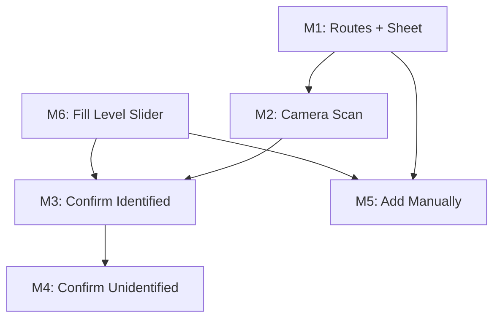

# Implementation Plan: Add to Inventory Flow

## Overview
Build the complete "Add to Inventory" flow for the BarBack Expo mobile app. When the user taps the FAB on the inventory tab, a bottom sheet presents options to scan or manually add a bottle. The scan path opens a nested camera screen within the inventory tab, captures a photo, and shows a confirm screen with either a successful VLM identification (green check, pre-filled form) or a failed identification (warning, manual input form). Built with Expo Router nested Stack routes, React Native, and the existing Midnight Mixologist design system. Matches 5 new Stitch screens exactly.

## MVP Scope
From locked `requirements.md`:
- Photo capture — camera + photo library
- Location picker — select sub-area within venue per session
- VLM identification — bottle name, category, fill level (0-10 tenths)
- User corrections — editable fields for name, category, fill level
- Session workflow — capturing → processing → reviewing → confirmed

## Stitch Screen Reference
| Screen | Stitch Title | HTML File |
|--------|-------------|-----------|
| Bottom sheet | Add to Inventory Bottom Sheet | `temp/add-to-inventory-sheet.html` |
| Camera scan | (reuses The Lab pattern) | `temp/scan.html` |
| Confirm (identified) | Confirm Scan Details | `temp/confirm-scan.html` |
| Confirm (with slider) | Confirm Scan Details (Updated) | `temp/confirm-scan-updated.html` |
| Manual form | Add Manually Form | `temp/add-manually-form.html` |
| Multi-bottle review | Review Scan Results | `temp/review-scan-results.html` |

## Milestones

### M1: Nested Inventory Routes + Bottom Sheet
- **Scope:** Restructure `app/(tabs)/inventory.tsx` into `app/(tabs)/inventory/` directory with Stack layout. Create `AddToInventorySheet` component. FAB triggers the sheet.
- **Acceptance Criteria:**
  - [ ] `inventory/_layout.tsx` wraps child routes in a headerless Stack
  - [ ] `inventory/index.tsx` renders the existing inventory list (moved, not rewritten)
  - [ ] FAB opens a Modal bottom sheet styled per Stitch: `bg-[#131313]/90`, `rounded-t-[24px]`, handle bar (w-12 h-1), title "Add to Cellar" (Newsreader 24px)
  - [ ] "Scan New Bottle" row: copper gradient bg, 48x48 icon circle with `photo_camera`, "Use camera for instant identification" subtitle (11px, 70% opacity)
  - [ ] "Add Manually" row: surfaceContainer bg, disabled (opacity 0.8, cursor-not-allowed), "Coming Soon" italic badge (9px, outline-variant border)
  - [ ] "Dismiss" text button (outline color, SpaceGrotesk 12px uppercase tracking-widest)
  - [ ] Tab navigation works correctly with directory-based route
- **Dependencies:** None
- **Complexity:** Medium
- **Files:**
  - DELETE `app/(tabs)/inventory.tsx`
  - CREATE `app/(tabs)/inventory/_layout.tsx`
  - CREATE `app/(tabs)/inventory/index.tsx`
  - CREATE `components/AddToInventorySheet.tsx`

### M2: Camera Scan Screen (Nested Route)
- **Scope:** Create `inventory/scan.tsx` — full-screen camera within the inventory tab stack. Reuses `CameraCapture`. Navigates to confirm with photo URI on capture.
- **Acceptance Criteria:**
  - [ ] "Scan New Bottle" navigates to `inventory/scan`
  - [ ] Header: back arrow + italic "BarBack" (matching Stitch confirm header)
  - [ ] Camera fills screen, cancel returns to inventory
  - [ ] Photo taken → navigates to `inventory/confirm?photoUri=<uri>&identified=true` (mock)
  - [ ] Photo library option available via alternate button
- **Dependencies:** M1
- **Complexity:** Small
- **Files:**
  - CREATE `app/(tabs)/inventory/scan.tsx`

### M3: Confirm Scan Details (Identified)
- **Scope:** Create `inventory/confirm.tsx` — shows captured photo + VLM result. Uses mock data for identification until backend is wired. Matches Stitch "Confirm Scan Details (Updated)" with fill level slider.
- **Acceptance Criteria:**
  - [ ] Green check circle icon (tertiary bg/border, neon glow shadow) + "Bottle Identified" (Newsreader 30px) + accuracy subtitle
  - [ ] 3:4 aspect ratio image from photoUri, gradient overlay at bottom, "VLM Match" badge (tertiary border-left accent, SpaceGrotesk 10px)
  - [ ] Fill level vertical slider alongside image (surfaceContainerLow bg, outline-variant border, range 0-100)
  - [ ] Underline-style form fields: "Distillery / Brand", "Expression / Product" (Newsreader italic 20px), "Category" (with edit icon)
  - [ ] "Active Inventory / Backstock" segmented toggle (surfaceContainerLow bg, selected = surfaceContainerHigh + primary text)
  - [ ] "Confirm & Add to Shelf" CTA (copper gradient, Manrope bold) + "Retake Photo" secondary (outline-variant border, primary text)
  - [ ] Technical metadata: "Captured At" + "Scan ID" (SpaceGrotesk 9px, outline color)
- **Dependencies:** M2, M6
- **Complexity:** Medium
- **Files:**
  - CREATE `app/(tabs)/inventory/confirm.tsx`

### M4: Confirm — Unidentified State
- **Scope:** Extend confirm screen for VLM failure. Warning icon, "Bottle Not Identified", route to manual form.
- **Acceptance Criteria:**
  - [ ] `identified=false` in route params triggers warning state
  - [ ] Warning exclamation icon replaces green check, outline-variant color
  - [ ] Image has question mark overlay + blur (matching Stitch unidentified card)
  - [ ] "UNIDENTIFIED" label (outline-variant, SpaceGrotesk 10px bold)
  - [ ] Primary CTA: "Add Details Manually" → navigates to `inventory/add-manually?photoUri=<uri>`
  - [ ] "Retake Photo" still available
- **Dependencies:** M3
- **Complexity:** Small
- **Files:**
  - MODIFY `app/(tabs)/inventory/confirm.tsx`

### M5: Add Manually Form
- **Scope:** Create `inventory/add-manually.tsx` — full manual entry form. If photoUri passed, image shows at top. Matches Stitch "Add Manually Form" exactly.
- **Acceptance Criteria:**
  - [ ] Header: back arrow + italic "BarBack"
  - [ ] Title: "Add Manually" (Newsreader 48px light) + subtitle (SpaceGrotesk 12px, outline)
  - [ ] If photoUri: 16:9 image with gradient overlay + "Reference Archive" label
  - [ ] Brand + Product Name: underline inputs (Newsreader placeholder, primary labels — SpaceGrotesk 10px uppercase)
  - [ ] Category + Size: picker/select inputs with dropdown arrow icon
  - [ ] Fill Level section: surfaceContainer bg, tertiary border-left accent, horizontal slider with "Empty / Half / Full" labels, percentage readout (Newsreader 30px primary)
  - [ ] Storage Location: picker with venue locations
  - [ ] "Add to Inventory" CTA: copper gradient, full width, SpaceGrotesk uppercase tracking
  - [ ] Quote footer: italic SpaceGrotesk 10px outline
- **Dependencies:** M1, M6
- **Complexity:** Medium
- **Files:**
  - CREATE `app/(tabs)/inventory/add-manually.tsx`

### M6: Fill Level Slider Component
- **Scope:** Reusable slider matching Stitch styling. Used in confirm (vertical) and add-manually (horizontal).
- **Acceptance Criteria:**
  - [ ] Props: `value: number`, `onValueChange: (n: number) => void`, `orientation?: 'horizontal' | 'vertical'`
  - [ ] Custom View-based (no @react-native-community/slider dependency)
  - [ ] Thumb: 16x16, primary color (#FFB782), square corners
  - [ ] Track: surfaceContainerHigh, 4dp height (or width for vertical)
  - [ ] Fill: primary color from 0 to current position
  - [ ] Touch/pan gesture to drag (PanResponder or Pressable + onLayout)
  - [ ] Horizontal: labels "Empty / Half / Full" below
  - [ ] Percentage readout component alongside
- **Dependencies:** None
- **Complexity:** Medium
- **Files:**
  - CREATE `components/FillLevelSlider.tsx`

## Milestone Dependencies

## Execution Strategy

**Parallel wave 1:** M6 (slider, no deps) + M1 (routes + sheet, no deps)
**Parallel wave 2:** M2 (scan) + M5 (add-manually) — both depend on M1 but write different files
**Sequential wave 3:** M3 (confirm) — depends on M2 + M6
**Sequential wave 4:** M4 (unidentified state) — extends M3

Agents can be dispatched: 2 in wave 1, 2 in wave 2, then 1 each for waves 3-4.

## Risks & Open Questions

| Risk | Impact | Mitigation |
|------|--------|------------|
| Expo Router directory restructure breaks tab nav | High | Test tab switching immediately after M1 |
| VLM not wired — mock data only | Low (UI-first) | Mock identification results; real integration is separate milestone |
| Custom slider gesture handling | Medium | Use PanResponder for cross-platform; test on both iOS and Android |
| Camera permissions in nested route | Low | Same permission flow as existing, just different navigation context |
| Form field count on confirm screen | Low | useState per field is fine for MVP; no form library needed |
