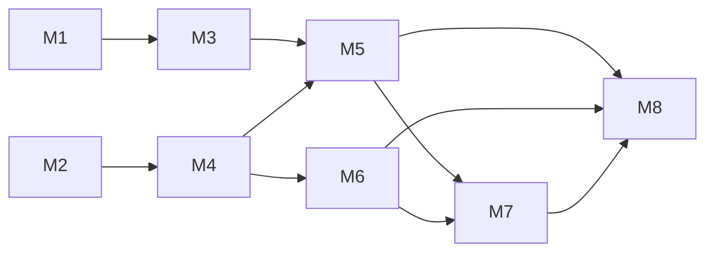

# Implementation Plan

## Overview
BarBack is a bar inventory management system that uses phone camera photos + a vision-language model (Claude Sonnet 4.6) to identify liquor bottles and estimate fill levels. Built as a Bun monorepo with an Expo/React Native mobile app (Ray), Hono backend with PostgreSQL (Jacob), and Mantine web dashboard (Patrick). Target users are bar managers/staff who currently spend ~5hrs/month counting bottles manually.

## MVP Scope
*(from locked requirements — 2026-04-10)*

- **Mobile:** Photo capture (camera + library), batch queue, location picker, SSE progressive review, editable fields + fill slider, session workflow, tab navigation, CSV export
- **Backend:** Hono + Bun, PostgreSQL + Drizzle, auth (seeded), venue/location/session/scan/inventory CRUD, Claude VLM pipeline, SSE streaming, PAR-based low-stock
- **Dashboard:** Mantine, inventory table, low stock, sessions, settings, landing/auth, CSV export
- **Shared:** Global bottle catalog (GTIN-12/UPC anchored), `itemCategoryEnum` (spirits + consumables), fill level as integer 0-10 tenths

## Milestones

### M1: Mobile Foundation
- **Owner:** Ray
- **Scope:** Convert bare Expo starter to Expo Router with file-based tab navigation. Establish project structure (app/, components/, lib/, types/). Define shared TypeScript types mirroring backend schema shapes for API contracts. Remove `@bartools/ui` dependency (dashboard already decoupled; mobile should own its own UI primitives).
- **Acceptance Criteria:**
  - [ ] `expo start` launches app with tab navigator showing 4 tabs: Capture, Inventory, Alerts, Settings
  - [ ] Each tab renders a placeholder screen with its name
  - [ ] TypeScript types for Session, Scan, Bottle, Inventory, Venue, Location exist in a shared `types/` directory
  - [ ] No runtime errors on iOS simulator
- **Dependencies:** None
- **Complexity:** Small

### M2: Backend API Core
- **Owner:** Jacob
- **Scope:** Auth endpoints (seeded users, sign in/sign up). Venue + location CRUD. Bottle catalog seeding from Verbena CSV. Session lifecycle endpoints (create, update status, confirm). Drizzle migrations applied to Postgres.
- **Acceptance Criteria:**
  - [ ] `POST /auth/signin` returns a token for seeded user credentials
  - [ ] `POST /venues` creates a venue; `POST /venues/:id/locations` creates a location
  - [ ] `GET /bottles` returns seeded Verbena catalog (~397 products)
  - [ ] `POST /sessions` creates a session with status `capturing`; `POST /sessions/:id/confirm` transitions to `confirmed`
  - [ ] Drizzle migrations run cleanly against docker-compose Postgres
- **Dependencies:** None
- **Complexity:** Medium

### M3: Photo Capture Flow
- **Owner:** Ray
- **Scope:** Camera integration using `react-native-vision-camera` v5 (requires Expo dev build, not Expo Go). Photo library picker via `expo-image-picker` for selecting existing photos. Batch queue UI — take/select multiple photos, see thumbnail grid, remove individual photos, submit batch. Location selector per session (dropdown of venue locations). Vision Camera chosen over expo-camera to set up the Frame Processor pipeline for Tier 2/3 (on-device YOLO detection, best-frame trigger, GPU resizing) without a future rewrite.
- **Acceptance Criteria:**
  - [ ] Expo dev build configured (no Expo Go dependency)
  - [ ] User can take a photo with `react-native-vision-camera` and it appears in the batch queue
  - [ ] User can select photos from the library (expo-image-picker) and they appear in the batch queue
  - [ ] Batch queue shows thumbnail grid with count; user can remove individual photos
  - [ ] User can select a location from a list before submitting
  - [ ] Submit button sends batch (disabled when queue is empty)
  - [ ] Camera permissions handled gracefully (request, denied state, settings link)
- **Dependencies:** M1
- **Complexity:** Medium

### M4: VLM Pipeline + SSE
- **Owner:** Jacob
- **Scope:** Batch image processing endpoint — accepts photos (multipart or presigned upload URLs), processes each through Claude Sonnet 4.6 via Agent SDK. SSE stream endpoint — pushes per-bottle results (name, category, fill tenths, confidence) as each completes. Store scans with `vlmFillTenths`, `rawResponse`, `modelUsed`, `latencyMs`, `confidenceScore`.
- **Acceptance Criteria:**
  - [ ] `POST /sessions/:id/scans` accepts image(s) and begins VLM processing
  - [ ] `GET /sessions/:id/stream` returns SSE events, one per processed scan, with bottle identification + fill estimate
  - [ ] Each scan row in the database contains `vlmFillTenths`, `rawResponse`, `modelUsed`, `latencyMs`
  - [ ] Processing handles VLM errors gracefully (retry, surface error in SSE event)
  - [ ] Rate limiting respects API constraints (sequential or throttled processing)
- **Dependencies:** M2
- **Complexity:** Large

### M5: Review & Confirmation
- **Owner:** Ray
- **Scope:** SSE client connecting to backend stream. Two-column ScrollView that populates progressively as results arrive: left column = photo thumbnail, right column = editable fields (bottle name, category, fill slider 0-10) + confidence indicator. Correction UX — tap to edit any field, adjust slider. Confirm button — POST corrected data to backend, transition session to `confirmed`.
- **Acceptance Criteria:**
  - [ ] ScrollView populates in real-time as SSE events arrive (not waiting for full batch)
  - [ ] Each row shows thumbnail, identified bottle name, category, and fill slider at VLM-estimated position
  - [ ] User can edit bottle name (search/select from catalog), category, and fill level via slider
  - [ ] Confirm action sends all corrections to backend and navigates to inventory view
  - [ ] Unrecognized bottles (no match) are visually distinct and allow manual entry
- **Dependencies:** M3, M4
- **Complexity:** Large

### M6: Inventory & Low-Stock API
- **Owner:** Jacob
- **Scope:** On session confirm: upsert inventory rows per (location, bottle) with confirmed fill levels. Inventory query endpoint with search, category filter, sort. PAR-based low-stock logic — per-product PAR overrides with venue-level default fallback. Return `belowPar` flag and `comparableUnit` per the dashboard data contract.
- **Acceptance Criteria:**
  - [ ] Confirming a session creates/updates inventory rows for each scanned bottle at the session's location
  - [ ] `GET /inventory` returns product-level rows with `onHandComparableAmount`, `belowPar`, `parComparableAmount`
  - [ ] `GET /inventory?lowStock=true` filters to below-PAR items only
  - [ ] PAR defaults can be set per venue; per-product overrides take precedence
  - [ ] Inventory reflects only confirmed session data (not in-progress scans)
- **Dependencies:** M4
- **Complexity:** Medium

### M7: Mobile Inventory, Alerts & Export
- **Owner:** Ray
- **Scope:** Inventory tab — fetch and display current stock by location, search/filter by name or category. Alerts tab — low-stock items surfaced with PAR context. Export action — generate CSV from inventory data, share via system share sheet. Settings tab — display venue info, location list, PAR default.
- **Acceptance Criteria:**
  - [ ] Inventory tab shows a searchable, filterable list of bottles with fill levels per location
  - [ ] Alerts tab shows only below-PAR items with clear visual treatment
  - [ ] Export produces a valid CSV file with bottle name, category, location, fill level, PAR status
  - [ ] CSV can be shared via iOS/Android share sheet
  - [ ] Settings tab displays venue name, locations, and PAR default value
- **Dependencies:** M5, M6
- **Complexity:** Medium

### M8: Integration & End-to-End
- **Owner:** All
- **Scope:** End-to-end flow validation: capture photos → VLM identifies → review/correct → confirm → inventory visible on both mobile and dashboard. Dashboard replaces fixtures with real backend API. Cross-platform testing using Verbena bottle photos. Bug fixes, error states, loading states, edge cases (empty inventory, VLM timeout, unrecognized bottle).
- **Acceptance Criteria:**
  - [ ] A user can complete the full capture→review→confirm flow on mobile and see updated inventory on the dashboard
  - [ ] Dashboard inventory table, low-stock view, and session detail all display real backend data
  - [ ] CSV export from both mobile and dashboard produces consistent data
  - [ ] Verbena test photos (9 labeled) produce correct identifications at ≥70% name accuracy
  - [ ] Error states are handled: VLM timeout shows retry option, empty inventory shows onboarding prompt, network errors show clear message
- **Dependencies:** M5, M6, M7
- **Complexity:** Large

## Milestone Dependencies

**Parallel tracks:**
- Ray: M1 → M3 → M5 → M7 → M8
- Jacob: M2 → M4 → M6 → M8
- Patrick: Dashboard work continues per `packages/dashboard/coordination/implementation-plan.md` (10 phases, independent until M8 integration)

M1 and M2 can start immediately in parallel. M3 and M4 can proceed in parallel. M5 is the convergence point where mobile meets backend.

## Tech Stack Summary

| Layer | Choice | Reference |
|-------|--------|-----------|
| Mobile | Expo SDK 54, Expo Router, React Native 0.81 | `packages/mobile/package.json` |
| Backend | Hono + Bun | `packages/backend/src/index.ts` |
| Database | PostgreSQL 16 + Drizzle ORM | `docker-compose.yml`, `packages/backend/drizzle.config.ts` |
| VLM | Claude Sonnet 4.6 via Agent SDK | `packages/eval/src/types.ts` |
| Eval | LangSmith + Agent SDK | `packages/eval/` |
| Dashboard | Vite + React + Mantine | `packages/dashboard/` |
| Monorepo | Bun workspaces | `package.json` |
| Image storage | TBD (S3/R2) | — |
| Production hosting | TBD (free/low-cost + custom domain) | — |

## Risks & Open Questions

| Risk | Impact | Likelihood | Mitigation |
|------|--------|-----------|------------|
| VLM accuracy on diverse bottle types | High — bad IDs erode trust | Medium | Eval harness tracks accuracy; user corrections as training data; fallback to Gemini if needed |
| SSE reliability on mobile (RN polyfill) | Medium — broken review UX | Low | `react-native-sse` is well-maintained; fall back to polling if SSE fails |
| Image storage not decided | Medium — blocks photo upload | Low | Use local filesystem or base64 for dev; S3/R2 decision before M4 |
| Gemini free tier rate limits if Claude costs escalate | Medium — slows batch processing | Low | Sequential processing within limits; batch of 200 at 10RPM = ~20 min |
| Dashboard-backend contract drift | Medium — integration pain at M8 | Medium | Data contracts in `packages/dashboard/specs/data-contracts.md` are the source of truth; backend implements to those shapes |
| Bottle catalog coverage | Medium — unrecognized bottles | Medium | Verbena CSV as seed; GTIN lookup APIs as enrichment; manual entry fallback |

### Open Questions
- **Image storage:** S3 vs R2 vs other — decide before M4 (Jacob)
- **Production hosting:** Fly.io vs Railway vs Render — decide before M8
- **Auth in production:** JWT vs session-based — decide during M2 (Jacob)
- **Barcode scanning:** On-device UPC scan as a capture input — stretch goal, not in milestones
